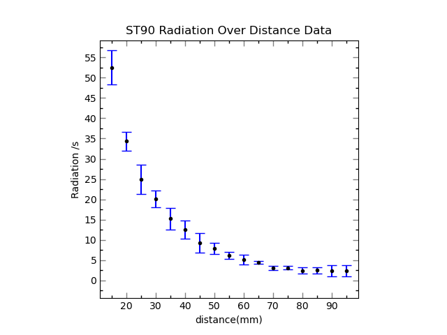

# PythonDataPlot
Simple Data Plotting with Python

# Usage

`plotData.py` is all that is required, other files are the data provided as samples.

```
plotData.py -i <inputFile> -o <outputFile.xxx> -d <delimiter> -x <x-min> -X <X-max> -y <y-min> -Y <Y-max> -H <Horizontal-Tick> -V <Vertical-Tick>
```
Unassigned parameters take default values


CSV file must be formated like this:
```
DATA_X, ERROR_X, DATA_Y, ERROR_Y
x     , dx     , y     , dy
```
For example,

```
plotData.py -i "ST90 Radiation Over Distance.csv" -o ST90OverDistancePlot.png -H 10 -V 5
```
Then final product, "ST90OverDistancePlot.png", the plot of "ST90 Radiation Over Distance.csv" should look like this with

